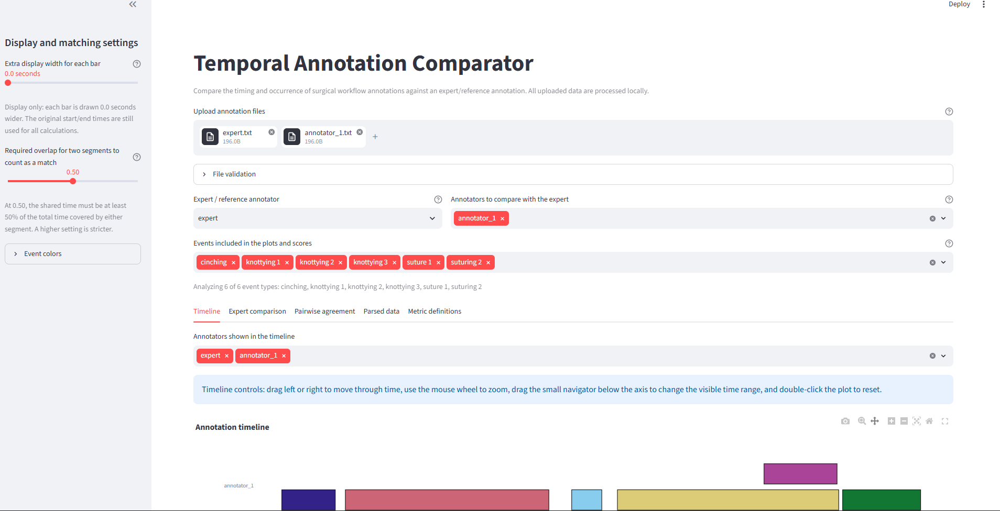
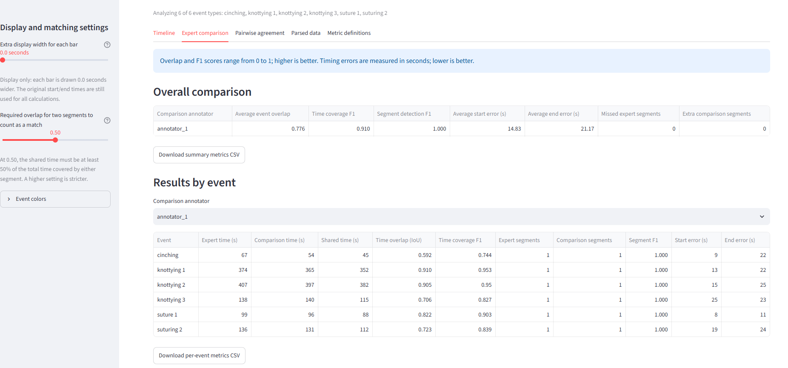
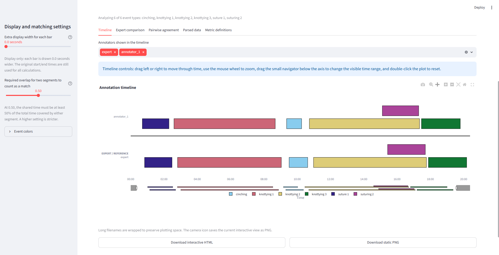

# Temporal Annotation Comparator

A local Streamlit web app for comparing interval-based surgical video annotations from multiple annotators.

## Main features

- Upload multiple `.txt` annotation files
- Select an expert/reference annotator
- Compare one or many annotators against the expert
- Isolate one event or compare any selected group of events
- Drag, zoom, and reset the interactive timeline with the mouse
- Wrapped long filenames to preserve timeline width
- Editable event colors
- Static PNG and interactive HTML downloads
- Overall and per-event agreement metrics
- Pairwise agreement heatmap
- CSV downloads
- Support for overlapping event labels
- Local processing of uploaded data

## Input format

Each non-empty line must use:

```text
Event Name: (HH:MM:SS, HH:MM:SS)
```

Example:

```text
Suture 1: (00:00:50, 00:02:52)
Suture 2: (00:03:31, 00:08:42)
Suture 3: (00:09:34, 00:10:21)
Knot Tying 1: (00:10:55, 00:17:28)
```

The uploaded filename becomes the annotator name.

## Metrics in plain language

### Time overlap (temporal IoU)

For each event, this measures the shared annotated time divided by all time marked by either annotator.

```text
shared time / total time marked by either annotator
```

A score of `1.00` means exact agreement. A score of `0.00` means no overlap.

### Average event overlap

Temporal IoU is calculated separately for each selected event and then averaged.

Each event type receives equal weight, so short events are not hidden by longer events.

### Time coverage F1

Measures how closely the total event timing agrees between the expert and comparison annotator.

It penalizes both:

- expert-annotated time that was missed
- extra time marked by the comparison annotator

A score of `1.00` means complete agreement.

### Segment F1

Measures whether individual event occurrences were identified correctly.

Two segments count as a match only when:

- they have the same event name
- their temporal IoU reaches the threshold selected in the sidebar

Missed expert segments and extra comparison segments both reduce this score.

### Start-time and end-time error

For matched segments, the app reports the average absolute difference between expert and comparison start and end times.

Errors are reported in seconds. Lower is better.

These values measure error magnitude only; they do not indicate whether the comparison annotator was early or late.

### Missed expert segments

Expert segments that did not match any comparison segment.

These indicate event occurrences that the comparison annotator failed to identify.

### Extra comparison segments

Comparison segments that did not match any expert segment.

These indicate event occurrences added by the comparison annotator but not supported by the expert annotation.

## Why standard accuracy is not the primary metric

The app permits overlapping events. More than one event can therefore be active at the same timestamp, which violates the assumptions of ordinary multiclass accuracy and standard confusion matrices.

Background-heavy videos can also make accuracy appear artificially high.

Temporal IoU, time coverage F1, segment F1, missed and extra segments, and boundary errors are more informative for this annotation structure.

## Download and run locally

Choose **one** of the following two paths.

### Path 1: Clone with Git

Use this path if Git is installed.

```bash
git clone https://github.com/Shekhar-Khairnar/annotation-comparison-app.git
cd annotation-comparison-app
```

Then continue to **Common setup steps** below.

### Path 2: Download as ZIP

Use this path if you do not want to use Git.

1. Open the GitHub repository.
2. Click **Code**.
3. Click **Download ZIP**.
4. Extract the ZIP file.
5. Open a terminal inside the extracted `annotation-comparison-app` folder.

Then continue to **Common setup steps** below.

### Common setup steps

#### 1. Create a virtual environment

Windows PowerShell:

```powershell
py -m venv .venv
.venv\Scripts\Activate.ps1
```

Windows Command Prompt:

```bat
py -m venv .venv
.venv\Scripts\activate.bat
```

macOS or Linux:

```bash
python3 -m venv .venv
source .venv/bin/activate
```

#### 2. Install the required packages

```bash
python -m pip install --upgrade pip
python -m pip install -r requirements.txt
```

#### 3. Start the app

```bash
python -m streamlit run app.py
```

Streamlit will print a local address, usually:

```text
http://localhost:8501
```

Open that address in a web browser.

## How to use

1. Upload two or more annotation `.txt` files.
2. Select the expert/reference annotation.
3. Select one or more comparison annotators.
4. Choose the event types to include. Select one event to isolate it.
5. Optionally change event colors in the sidebar.
6. Inspect the interactive timeline.
7. Drag left or right to pan through time.
8. Use the mouse wheel or navigator to zoom.
9. Double-click the plot to reset the view.
10. Set the required segment-overlap threshold.
11. Review overall and per-event metrics.
12. Download plots and CSV files.

## Slider meanings

### Extra display width for each bar

Adds visual width to the right side of every bar so short events are easier to see.

This changes only the plot. It does not change annotation times or scores.

### Required overlap for segment matching

Controls how strict individual segment matching is.

At `0.50`, the shared time must be at least 50% of the total time covered by either segment.

Higher values require more precise temporal agreement before two segments count as the same occurrence.

## Downloads

The app can export:

- interactive timeline as HTML
- static timeline as PNG
- overall comparison metrics as CSV
- per-event metrics as CSV
- pairwise temporal IoU matrix as CSV
- parsed annotation data as CSV

## Repository structure

```text
annotation-comparison-app/
├── app.py
├── annotation_app/
│   ├── __init__.py
│   ├── metrics.py
│   ├── parser.py
│   └── plots.py
├── sample_annotations/
├── requirements.txt
├── .gitignore
├── LICENSE
└── README.md
```

## App screenshots

### App overview

Upload annotation files, select the expert/reference annotator, choose comparison annotators, filter events, and adjust matching settings.



### Expert comparison metrics

View overall agreement and event-level metrics, including temporal overlap, F1 scores, timing errors, and missed or extra segments.



### Interactive timeline comparison

Compare the expert and annotator timelines, zoom or pan through time, change event colors, and download the plot.



## Technical assumptions

- Intervals are interpreted as continuous half-open intervals: `[start, end)`.
- Zero-duration intervals are excluded from metric calculations.
- Same-class overlapping intervals from one annotator are merged for duration-based metrics.
- Segment-level metrics use the original individual segments.
- Metrics use original endpoints, not visually extended endpoints.
- Selected event filters apply to plots and scores.
- Event names must match exactly between files.
- All processing occurs locally in the Streamlit process.

## License

This project is released under the MIT License.

# Copyright (c) 2026 Shekhar Khairnar
